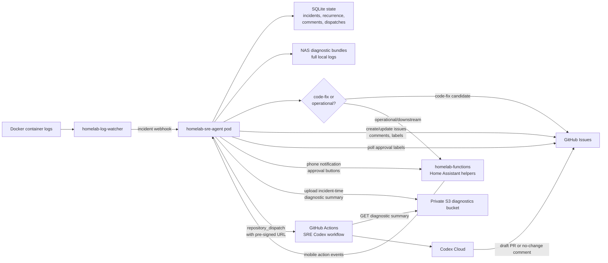

# Architecture

`homelab-sre-agent` is the middle of a small event pipeline. The log watcher is
the detector; the SRE agent is the incident coordinator; GitHub and Codex are
the review and autofix surfaces.

## Pipeline View

## Service Boundaries

### `homelab-log-watcher`

Owns detection:

- Tails Docker logs.
- Matches configured patterns.
- Emits structured incident webhooks.
- Provides the original container, severity, matched pattern, timestamps, and
  source fingerprint.

It should stay simple. It should not decide recurrence, suppression, GitHub
issue lifecycle, or Codex dispatch.

### `homelab-sre-agent`

Owns incident coordination:

- Receives incident webhooks.
- Matches incidents to service metadata from `homelab-config`.
- Collects Docker log context through the local Docker socket.
- Writes full diagnostic bundles on NAS disk.
- Computes stable incident families and recurrence summaries.
- Classifies obvious downstream dependency failures as operational notify-only
  events instead of source-repo code issues.
- Creates or updates GitHub issues and comments.
- Sends phone notifications through `homelab-functions`.
- Polls GitHub labels for approved autofix.
- Uploads the bounded S3 diagnostic summary when a code-fix issue is created or
  updated.
- On approval, signs the stored diagnostic object and dispatches the Codex
  workflow.

### `homelab-functions` / Home Assistant

Owns user notification delivery:

- Sends phone notifications.
- Carries approval button actions back through Home Assistant mobile app events.
- Does not own SRE issue state or GitHub dispatch policy.

### GitHub Issues

Owns the durable human review surface:

- Public-safe issue body.
- Labels such as `sre:autofix-approved` and `sre:human-investigating`.
- SRE agent comments explaining repeats, blocks, dispatches, or no-change
  outcomes.

### Private S3 Diagnostics Bucket

Owns temporary diagnostic handoff for cloud Codex:

- Receives bounded diagnostic summaries from the NAS over outbound HTTPS.
- Serves one object through a short-lived pre-signed URL.
- Does not expose the NAS or local network.

### GitHub Actions / Codex

Owns approved investigation:

- Fetches GitHub issue context.
- Fetches diagnostic context from S3 when provided.
- Runs Codex against the source repo.
- Opens a draft PR only when it finds a high-confidence code/config change.
- Posts a no-change investigation comment when it cannot justify a fix.

## Event Ordering

1. Log watcher detects a matching Docker log event.
2. Log watcher sends an incident webhook to SRE agent.
3. SRE agent writes local diagnostics and classifies the incident.
4. Code-fix candidates create or update a GitHub issue. Operational/downstream
   incidents record local recurrence and notify with cooldown, but do not create
   a source-repo issue.
5. A human approves autofix by applying `sre:autofix-approved` or pressing the
   phone approval action.
6. SRE agent polls GitHub, sees approval, checks cooldowns and daily limits.
7. SRE agent signs the stored S3 diagnostic summary with a temporary URL.
8. SRE agent sends `repository_dispatch` to the source repo with issue metadata
   and the diagnostic URL.
9. GitHub Actions fetches the SRE context and runs Codex.
10. Codex opens a draft PR or comments investigation findings without code
   changes.

## Directionality

All cloud communication is outbound from the NAS or outbound from GitHub
Actions:

- NAS to GitHub: issues, labels, dispatch.
- NAS to S3: incident-time diagnostic summary upload.
- NAS to `homelab-functions`: notification request.
- GitHub Actions to S3: diagnostic summary download.

There is no inbound cloud-to-NAS path for Codex.
